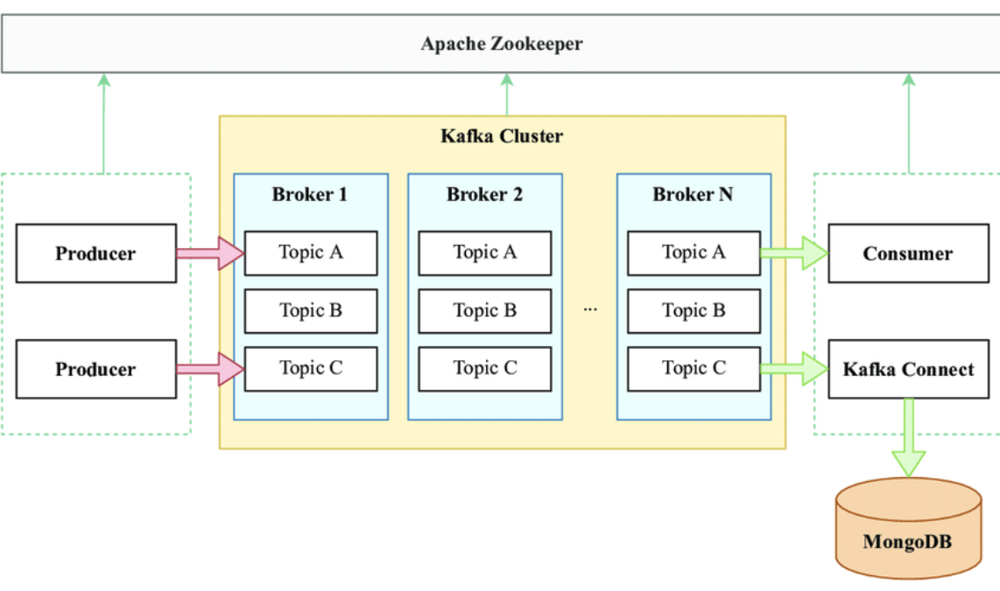

## Kafka Messaging

Kafka Messaging Api provide high-level, asynchronous message (AIOKafka). Between Producer and Consumer.


**poetry commands**

add drivers
```shell
mac
poetry add fastapi uvicorn\[standard\] sqlmodel psycopg 

window
poetry add fastapi uvicorn[standard] sqlmodel psycopg 
```

**aiokafka**
Is an asynchronous Kafka client for Python, which allows your application to interact with Apache Kafka message brokers in an asynchronous manner.

```shell
poetry add aiokafka
```

### docker commands

**rebuild the image** 
  ```shell
 docker compose up --build 
```

**stops and removes the service**
```shell
 docker compose down
```
1. Stop all containers
2. Remove all containers
3. Remove all networks

**stops and removes the specific service**
```shell
 docker compose down service_name
```

**view logs (real-time monitoring)**
 ```shell
 docker-compose logs service-name -f
```
- f  (follow)(real-time.) (give all the command running on terminal)
    
**AIOKafkaProducer Todo**

AIOKafkaProducer is a high-level, asynchronous message producer.

```shell
    @app.post("/api_todos/", response_model=Todo)
    async def create_todo(todo: Todo, session: Annotated[Session, Depends(get_session)], producer: Annotated[AIOKafkaProducer, Depends(get_kafka_producer)])->Todo:
        todo_dict = {field: getattr(todo, field) for field in todo.dict()}
        todo_json = json.dumps(todo_dict).encode("utf-8")
        print("todoJSON :  ", todo_json)
        # Produce message
        await producer.send_and_wait("todos", todo_json)
        session.add(todo)
        session.commit()
        session.refresh(todo)
        return todo
```

**AIOKafkaConsumer Todo**

AIOKafkaConsumer is a high-level, asynchronous message consumer. It interacts with the assigned Kafka Group Coordinator node to allow multiple consumers to load balance consumption of topics (requires kafka >= 0.9.0.0).

```shell
    async def consume_messages(topic, bootstrap_servers):
    # Create a consumer instance.
    consumer = AIOKafkaConsumer(
        topic,
        bootstrap_servers=bootstrap_servers,
        group_id="my-group",
        auto_offset_reset='earliest'
    )
    # Start the consumer.
    await consumer.start()
    try:
        # Continuously listen for messages.
        async for message in consumer:
            print(f"Consumer Received message: {message.value.decode()} on topic {message.topic}")
            # Here you can add code to process each message.
            # Example: parse the message, store it in a database, etc.
    finally:
        # Ensure to close the consumer when done.
        await consumer.stop()    
```
**AIOKafka**  
[Producer - Consumer](https://github.com/aio-libs/aiokafka) 

#### Kafka

```shell
KAFKA_ADVERTISED_LISTENERS: 'PLAINTEXT_HOST://localhost:9092,PLAINTEXT://broker:19092'
```
PLAINTEXT_HOST://localhost:9092,PLAINTEXT://broker:19092 
PLAINTEXT_HOST://localhost:external-call,PLAINTEXT://broker:internal-call

**offset** index of array

#### Volume (compose.yaml)

**1- Bind Mount Volume (BMV):**
A bind mount volume is a directory on the host machine that is mounted into a container.

#### -./host-machine:/container

```yaml 
volumes:
      - ./service_name:/code  # Sync local development directory with the container
```

**2- Persistent Volume (PV):** 
A persistent volume is a resource that is provisioned and managed by Kubernetes. It is used to store data that needs to be preserved even if a Kafka container is deleted or recreated.
In both cases, the data is stored outside of the container, so it is not lost when the container is deleted or recreated

Bind Mount Volume (BMV): a directory on the host machine that is mounted into a container.

Persistent Volume (PV): a resource that is provisioned and managed by Kubernetes.

**Bootstrap Serve** (Internal Server of Kafka, actually kafka node is Bootsrtap Server) 
"Bootstrap Server" typically refers to a Kafka broker address that the Kafka clients use initially to connect to the Kafka cluster. It provides the Kafka clients with the information necessary to discover the full Kafka cluster.
(Broker and Bootstrap Serve are directly proportional)

**Kafka Architecture**

<div style="text-align: center;">
    </img>
</div>


**Kafka Messaging**

[GenAI Quarter 5 Online Class 13: Serialization and Deserialization Kafka Messages](https://www.youtube.com/watch?v=qVbAYHxW3xg&list=PL0vKVrkG4hWqWNAr6rcX0gOvU_eOULnJN&index=16)

[15_event_driven: 02_kafka_messaging](https://github.com/panaverse/learn-generative-ai/tree/main/05_microservices_all_in_one_platform/15_event_driven/02_kafka_messaging)

### Online Class

#### Playlist

[Modern Cloud Native AI Stack: Python, Poetry, Docker.. Online Class)](https://www.youtube.com/playlist?list=PL0vKVrkG4hWqWNAr6rcX0gOvU_eOULnJN)

[Docker - Complete Tutorial: (Docker File, Image, Container](https://www.youtube.com/playlist?list=PL0vKVrkG4hWoTh2SaepYf9N8ywxz_Cyfx)

[Apache Kafka - Event Driven Architecture](https://www.youtube.com/playlist?list=PL0vKVrkG4hWrlSxLssJeuyMKGIegYiUyz)

[Generative AI with Cloud-Native Power: Microservices, Multi-Agent](https://www.youtube.com/playlist?list=PL0vKVrkG4hWpk12F7wO41kdFWhuXuigDW)

[Cloud Deployment - Azure Container Apps](https://www.youtube.com/playlist?list=PL0vKVrkG4hWrqwmlQ6k8ArJ93BrwX6V4l)


#### Docker Compose
[GenAI Quarter 5 Online Class 08: Docker Compose - Running Multi Containers with Docker Compose](https://www.youtube.com/watch?v=l5eZMAhDwhQ&list=PL0vKVrkG4hWoTh2SaepYf9N8ywxz_Cyfx&index=6)

#### Dev Container
[Dev Container Online Class 06: What is Dev Container - Development inside Containers - Docker](https://www.youtube.com/watch?v=h32qw986-tI)

#### Kafka
[GenAI Quarter 5 Online Class 12: Interact with Kafka using aiokafka - A Python Library for Kafka](https://www.youtube.com/watch?v=PAU05OrLgho)

[GenAI Quarter 5 Online Class 13: Serialization and Deserialization Kafka Messages](https://www.youtube.com/watch?v=qVbAYHxW3xg&list=PL0vKVrkG4hWqWNAr6rcX0gOvU_eOULnJN&index=13)

#### Portobuf
[GenAI Quarter 5 Online Class 14: Protobuf in Kafka & Introduction to Kong - An API Gateway](https://www.youtube.com/watch?v=nMXMV48EiQA)

[GenAI Quarter 5 Online Class 13: Serialization and Deserialization Kafka Messages](https://www.youtube.com/watch?v=qVbAYHxW3xg)

#### Pg Admin
[GenAI Quarter 5 Online Class 08: Docker Compose - Running Multi Containers with Docker Compose](https://www.youtube.com/watch?v=l5eZMAhDwhQ&t=3117s)

[GenAI Quarter 5 Online Class 07: Docker Compose - Orchestrate Multi-Container Applications with Ease](https://www.youtube.com/watch?v=cpu44VE_J1I&t=5554s) 

### Github

[Even Driven Architecture](https://github.com/panaverse/learn-generative-ai/tree/main/05_microservices_all_in_one_platform/15_event_driven)

[Docker Compose with Database Service](https://github.com/panaverse/learn-generative-ai/tree/main/05_microservices_all_in_one_platform/14_docker/05_compose_db)

[Synchronous Inter Services Messages between Microservices](https://github.com/panaverse/learn-generative-ai/tree/main/05_microservices_all_in_one_platform/14_docker/07_synchronous_messages)

[A Challenge: FastAPI Event Driven Microservices Development With Kafka, KRaft, Docker Compose, and Poetry](https://github.com/panaverse/learn-generative-ai/tree/main/05_microservices_all_in_one_platform/15_event_driven/00_eda_challenge)

**Tutorial**

[Lifespan Events](https://fastapi.tiangolo.com/advanced/events/#lifespan-function)

**Clone Repository**

```shell
git clone <repository-url>  
```
    
 # Kafka-Messages-DB
